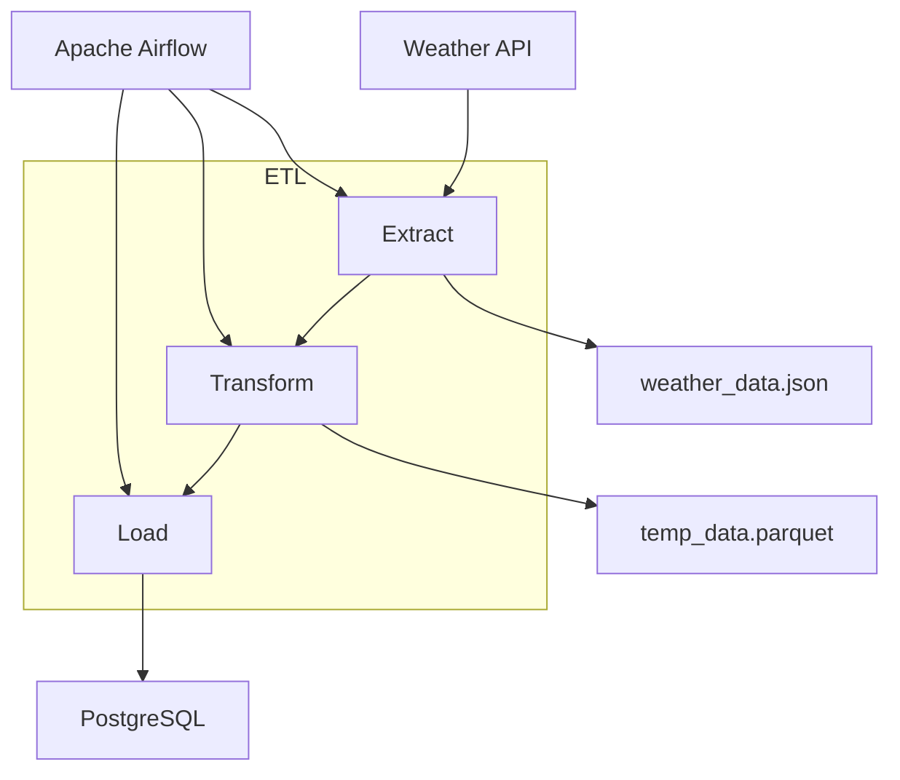

# 🌦️ Weather ETL Pipeline

Pipeline ETL para coleta, transformação e armazenamento de dados meteorológicos utilizando Python, Apache Airflow, Docker e PostgreSQL.

## 📖 Sobre o Projeto

Este projeto tem como objetivo automatizar a extração, transformação e persistência de dados meteorológicos por meio de uma pipeline ETL orquestrada pelo Apache Airflow.

A solução foi desenvolvida seguindo uma arquitetura modular, separando claramente as responsabilidades de:

* Extração dos dados da API meteorológica
* Transformação e tratamento dos dados
* Persistência dos dados processados
* Orquestração das tarefas com Airflow

Além da execução automatizada via Airflow, os módulos podem ser reutilizados em scripts locais, notebooks de análise ou futuras APIs.

---

## 🏗️ Arquitetura da Solução



---

## 📂 Estrutura do Projeto

```text
.
├── config/
│   └── airflow.cfg
├── dags/
│   └── weather_dag.py
├── data/
│   ├── weather_data.json
│   └── temp_data.parquet
├── notebooks/
│   └── analysis_data.ipynb
├── src/
│   ├── extract_data.py
│   ├── transform_data.py
│   └── load_data.py
├── docker-compose.yaml
├── main.py
├── pyproject.toml
└── README.md
```

### Diretórios

| Diretório    | Descrição                                |
| ------------ | ---------------------------------------- |
| `src/`       | Código-fonte da pipeline                 |
| `dags/`      | DAGs do Apache Airflow                   |
| `data/`      | Arquivos temporários e dados processados |
| `notebooks/` | Análises exploratórias e validações      |
| `config/`    | Configurações do Airflow                 |
| `logs/`      | Logs gerados pelo Airflow                |

---

## ⚙️ Tecnologias Utilizadas

* Python 3.12+
* Apache Airflow
* Docker
* Docker Compose
* PostgreSQL
* Pandas
* Requests
* Parquet

---

## 🚀 Como Executar

### 1. Clonar o repositório

```bash
git clone https://github.com/brendorodri/weather-airflow-pipeline.git
cd weather-etl
```

### 2. Instalar dependências

Utilizando UV:

```bash
uv sync
```

Ou com pip:

```bash
pip install -r requirements.txt
```

---

### 3. Subir ambiente com Docker

```bash
docker compose up -d
```

Verificar containers:

```bash
docker ps
```

---

### 4. Acessar o Airflow

```text
http://localhost:8080/dags
```

---

## 🔄 Fluxo da Pipeline

### Extração

Responsável por consumir os dados da API meteorológica e armazenar a resposta bruta em formato JSON.

Arquivo:

```text
src/extract_data.py
```

---

### Transformação

Responsável pela limpeza, padronização e estruturação dos dados para análise.

Arquivo:

```text
src/transform_data.py
```

---

### Carga

Responsável pela persistência dos dados processados em formato estruturado.

Arquivo:

```text
src/load_data.py
```

---

### Orquestração

Toda a execução é controlada pela DAG:

```text
dags/weather_dag.py
```

---

## 📊 Dados Gerados

### JSON

Dados brutos retornados pela API:

```text
data/weather_data.json
```

### Parquet

Dados tratados e prontos para consumo:

```text
data/temp_data.parquet
```

---

## 📈 Análise Exploratória

O projeto possui um notebook para validação e exploração dos dados:

```text
notebooks/analysis_data.ipynb
```

---

## 🛠️ Melhorias Futuras

* [ ] Persistência em PostgreSQL
* [ ] Testes unitários
* [ ] Testes de integração
* [ ] Monitoramento e alertas
* [ ] Data Quality Checks
* [ ] Integração com serviços em nuvem
* [ ] Versionamento de dados
* [ ] Dashboard de métricas

---

## 📄 Licença

Este projeto foi desenvolvido para fins de estudo e demonstração de conhecimentos em Engenharia de Dados, Python e Apache Airflow.
